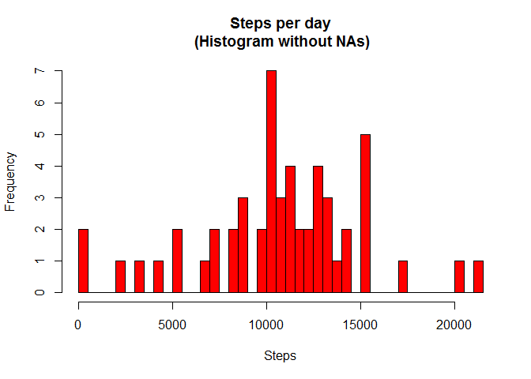

# Reproducible Research: Peer Assessment 1
Jerry Currie  
2015-02-12  

## Load Libraries
- dplyr
- lubridate
- timeDate

```r
library(dplyr)
```

```
## 
## Attaching package: 'dplyr'
## 
## The following object is masked from 'package:stats':
## 
##     filter
## 
## The following objects are masked from 'package:base':
## 
##     intersect, setdiff, setequal, union
```

```r
library(lubridate)
library(timeDate)
```
## Loading and preprocessing the data

```r
#Read data file 
dfactivity<-read.csv("activity.csv")
dfactivity$id<-1:nrow(dfactivity)
dfactnaf<-na.omit(dfactivity) #dataset without NAs
 

#Populate variables for histogram and averages
grp <- group_by(dfactnaf, date) #Group by date
sumsteps<-summarise(grp, sum=sum(steps)) #sum steps by day

#Calclate mean and median outputs
meanperday<-mean(sumsteps$sum)  #calculate mean steps per day
medianperday<-median(sumsteps$sum) #calculate median steps per day
```

## What is mean total number of steps taken per day?
The histogram (below) shows number of steps per day grouped into clusters.
The frequency represents the number of times data fell into each
cluster.


```r
#histogram of steps per day
hist(sumsteps$sum, main="Steps per day",ylab="Frequency", xlab="Steps", breaks=nrow(sumsteps), col="red")
```

 
 
- The average (mean) number of steps is <b>10,766.19</b> over 53 days.
- The median number of steps is <b>10,765</b> over 53 days.


```r
grp2<-group_by(dfactnaf,interval) #Group by interval
sumstepsinterval<-summarise(grp2, sum=sum(steps)) #average steps by interval
sumstepsinterval$avgstepperday<-sumstepsinterval$sum/nrow(sumsteps)
#build interval string for time by additing 10000 to each interval.
#this will allows taking the 2&3 values as hours and the 4&5 values
#as minutes without incurring an error from the earlier time intervals.
sumstepsinterval$K<-sumstepsinterval$interval+10000 
#Get max avg step per day info 
maxavgstepperday<-sumstepsinterval[which(sumstepsinterval[, 3] == max(sumstepsinterval$avgstepperday)), ]
 

#Calculate time of day from 5-minute interval
t<-as.POSIXlt("1970-01-01 00:00:00 PST") #initialize time
tmpmin<-substr(toString(maxavgstepperday$K),4,5)
tmphour<-substr(toString(maxavgstepperday$K),2,3)
t$min<-t$min + as.numeric(tmpmin)
t$hour<-t$hour+as.numeric(tmphour)
tcvt<-strftime(t, format = "%I:%M:%S %p")
```


## What is the average daily activity pattern?
### Weekday Activity
There are 288 5-minute time intervals ranging from 0 to 2355. The x-axis corresponds to the specific interval break points found in the data set.

```r
plot(sumstepsinterval$avgstepperday,type="l", xaxt="n",  xlab="5-minute step intervals", ylab="Avg steps per day", main="Average Daily Activity")
axis(1, at=c(1,49,97,145,193,241,288), labels=c("12:00 am","4:00","8:00","12:00 pm","4:00","8:00","12:00 am"))
```

 

- The time inteval ''835-840'' contains the highest average number of steps at: <b>206.17</b> per day

- The most popular time of day for stepping is:<b> 08:35:00 AM</b>.

(note: The data contains 12 5-minute groups per hour (0-55). After reaching the 12th member of the group (interval ending in 55), the interval's hundred digit is incremented representing the current hour (i.e. The interval 100=1:00 am, 105=1:05 am ... 2355 = 11:55 pm.))

 
## Imputing missing values

```r
#Get NA count from original data set
sumna<-sum(is.na(dfactivity$step))
#Create NA subset of dfactivity
dfisna<-dfactivity[is.na(dfactivity[,1])==T,]
#Join on sumstepsinterval$interval return 
ajoin<-merge(dfisna, sumstepsinterval, by="interval")
#update NA steps with avg step per day for interval
ajoin$steps<-ajoin$avgstepperday
#Row bind dfactnaf with ajoin data frame to build completely filled
#version of the original data set (dfactivity)
tempactivity<-rbind(dfactnaf, ajoin[,c(1:4)])
newactivity<-arrange(tempactivity, id) 
```
- There are <b>2304</b> missing values (NAs) in the main data set of <b>17568</b> records.

Create data for Histogram containing average step values for all NAs in original data set.

```r
#Populate variables for histogram and averages
grp3 <- group_by(newactivity, date) #Group by date
sumsteps3<-summarise(grp3, sum=sum(steps)) #sum steps by day

#Calclate mean and median outputs
meanperday3<-mean(sumsteps3$sum)  #calculate mean steps per day
medianperday3<-median(sumsteps3$sum) #calculate median steps per day
```


```r
#histogram of steps per day
hist(sumsteps3$sum, main="Steps per day",ylab="Frequency", xlab="Steps", breaks=nrow(sumsteps3), col="red") 
```

 
- The average (mean) number of steps is <b>10,766.19</b> over 61 days.
- The median number of steps is <b>10,766.19</b> over 61 days.

## Are there differences in activity patterns between weekdays and weekends?

```r
#Create field for identifying weekdays and weekend (weekday)
newactivity$weekday[isWeekday(newactivity$date) == T] <- "Weekday"
newactivity$weekday[isWeekday(newactivity$date) == F] <- "Weekend"
#create data frames separating weekday and weekends
dfweekend<-newactivity[which(newactivity[, 5] == "Weekend"), ]
dfweekday<-newactivity[which(newactivity[, 5] == "Weekday"), ]
```


```r
grp4<-group_by(dfweekend,interval) #Group by interval
wesumstepsinterval<-summarise(grp4, sum=sum(steps)) #average steps by interval
wesumstepsinterval$avgstepperdaywe<-wesumstepsinterval$sum/nrow(sumsteps)
#build interval string for time by additing 10000 to each interval.
#this will allows taking the 2&3 values as hours and the 4&5 values
#as minutes without incurring an error from the earlier time intervals.
wesumstepsinterval$K<-wesumstepsinterval$interval+10000 
#Get max avg step per day info 
maxavgstepperday3<-wesumstepsinterval[which(wesumstepsinterval[, 3] == max(wesumstepsinterval$avgstepperdaywe)), ]
```


```r
grp5<-group_by(dfweekday,interval) #Group by interval
wdsumstepsinterval<-summarise(grp5, sum=sum(steps)) #average steps by interval
wdsumstepsinterval$avgstepperdaywd<-wdsumstepsinterval$sum/nrow(sumsteps)
#build interval string for time by additing 10000 to each interval.
#this will allows taking the 2&3 values as hours and the 4&5 values
#as minutes without incurring an error from the earlier time intervals.
wdsumstepsinterval$K<-wdsumstepsinterval$interval+10000 
#Get max avg step per day info 
maxavgstepperday4<-wdsumstepsinterval[which(wdsumstepsinterval[, 3] == max(wdsumstepsinterval$avgstepperdaywd)), ]
```


 

```r
##################  Plot 4 Charts ###########################################
#plot 4) - 4 line plots on single image
 
#attach(sumstepsintervalwd)
par(mfrow=c(2,1))
par(pin=c(5,1.5))
#First plot Weekend scaled to maximum weekday
plot(wesumstepsinterval$avgstepperdaywe,type="l", ylim=c(0,max(wdsumstepsinterval$avgstepperdaywd)), xaxt="n",  xlab="5-minute step intervals", ylab="Avg steps per day", main="Average Weekend Daily Activity")
axis(1, at=c(1,49,97,145,193,241,288), labels=c("12:00 am","4:00","8:00","12:00 pm","4:00","8:00","12:00 am"))
#Second plot weekday
plot(wdsumstepsinterval$avgstepperdaywd,type="l", xaxt="n",  xlab="5-minute step intervals", ylab="Avg steps per day", main="Average Weekday Daily Activity")
axis(1, at=c(1,49,97,145,193,241,288), labels=c("12:00 am","4:00","8:00","12:00 pm","4:00","8:00","12:00 am"))
```

 

```r
##################  End Plot 4 Charts ######################################
```


 
